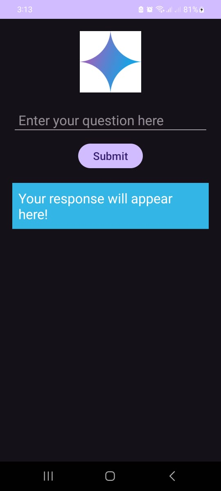
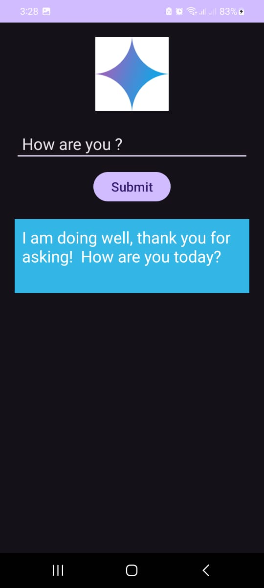
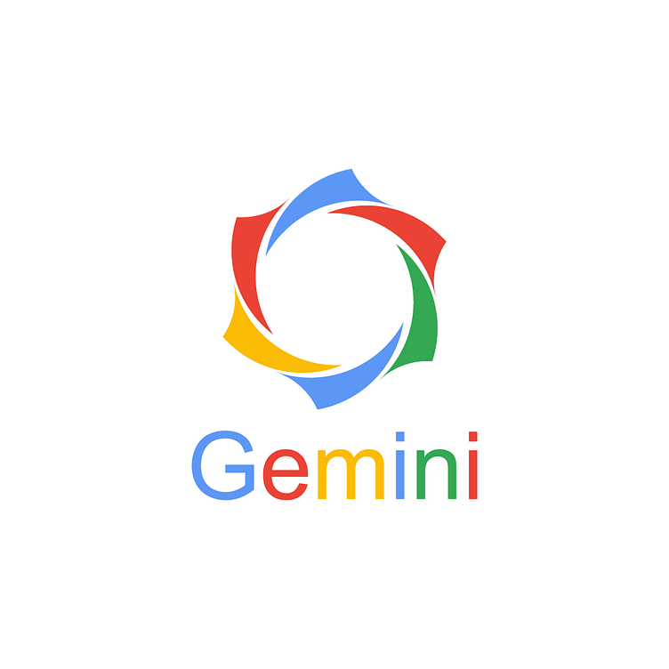

# Gemini-AI ChatApp

Gemini-AI ChatApp is an Android application that allows users to interact with an AI chatbot, ask questions, and receive responses in real-time. The app is designed with a user-friendly interface that includes a chat feature where users can enter their queries and view answers directly from the chatbot.

## Features

- **Ask Questions**: Users can input questions in a text box.
- **Instant AI Response**: The app provides quick responses based on the user's query.
- **Modern UI**: Clean and minimalistic design with easy navigation.
- **Logo at the top**: The app includes a logo at the top to enhance branding.
- **Colored Response Box**: Responses from the chatbot are displayed in a stylish, colored box.
- **Centered Submit Button**: The 'Submit' button is centered for easy access.

## Screenshots

### 1. **Home Screen**

*Description: The user enters a question in the EditText, and the 'Submit' button is centered below.*

### 2. **Response Screen**

*Description: After submitting the question, the AI response appears in a colored box.*

### 3. **Logo and Branding**

*Description: The app displays a logo for branding purposes.*

---

## Download APK

You can download the APK for Gemini-AI ChatApp from the link below:

[Download Gemini-AI ChatApp APK](https://drive.google.com/file/d/1DI4RUJACyrZ98L989VIWZaVHTNK9i9hP/view?usp=sharing)

## Installation

1. Clone this repository or download the ZIP file.
2. Open the project in **Android Studio**.
3. Build the project using **Build > Make Project**.
4. Connect an Android device or use the emulator to run the app.
5. The app will be available on your device/emulator.

## Usage

1. Open the app after installation.
2. Enter a question in the **EditText** field.
3. Click on the **Submit** button to receive an AI-generated response.
4. The response will be displayed in a colored box on the screen.

## Technologies Used

- **Kotlin**: The app is developed using Kotlin for simplicity and modern features.
- **Android SDK**: The app is built using Android's standard SDK.
- **Material Design**: The app uses Material Design components for a modern and intuitive user interface.
- **Chatbot Integration**: A simple response-based logic for AI interaction.

## Contributions

Feel free to fork this repository and contribute by submitting pull requests for improvements or bug fixes.

## License

This project is licensed under the MIT License.

---
